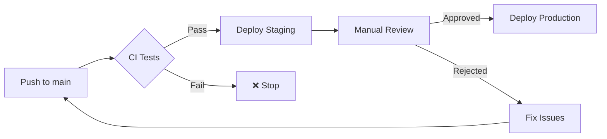

# Continuous Deployment with Kamal + GitHub Actions

## TL;DR: Yes, You Can!

Your current GitHub workflow + Kamal setup supports CD. This document explains how to implement it when ready.

---

## Current Status

✅ **You have:**
- Kamal configured (`config/deploy.yml`)
- GitHub Actions CI workflow (tests, linting, security scans)
- Staging and production environments defined

✅ **What's missing for CD:**
- GitHub Actions workflow to trigger Kamal deploy
- GitHub Secrets for deployment credentials
- Deployment strategy decision

---

## CD Strategies (Choose One)

### Strategy 1: Auto Staging, Manual Production ⭐ **RECOMMENDED**

**Best for:** Side projects, small teams

**How it works:**
- Every push to `main` → auto deploy to **staging**
- Production deploy via **manual trigger** in GitHub UI
- Safe, predictable, easy rollback

**Pros:**
- ✅ Safe for production (requires manual approval)
- ✅ Staging always up-to-date for testing
- ✅ Simple to implement

**Cons:**
- ❌ Requires manual click for production

---

### Strategy 2: Deploy on Git Tags

**Best for:** Versioned releases, controlled deployments

**How it works:**
- Push tag `v1.0.0` → deploy to **production**
- Regular commits → no deployment (or staging only)

**Pros:**
- ✅ Clear release history
- ✅ Easy rollback to specific versions
- ✅ No accidental deployments

**Cons:**
- ❌ Extra step (creating tags)

---

### Strategy 3: Auto Everything (Dangerous)

**Best for:** Experimental projects, high-risk tolerance

**How it works:**
- Every push to `main` → deploy to **production**

**Pros:**
- ✅ Fastest time to production

**Cons:**
- ❌ No safety net
- ❌ Can break production easily
- ❌ Not recommended for real users

---

## Implementation Guide

### Step 1: Add GitHub Secrets

Navigate to: `GitHub Repo → Settings → Secrets and variables → Actions`

Add these secrets:

| Secret Name | Description | How to Get |
|-------------|-------------|------------|
| `SSH_PRIVATE_KEY` | SSH key to access your server | `cat ~/.ssh/id_rsa` (or your deploy key) |
| `SERVER_HOST` | Server IP/hostname | Your Digital Ocean droplet IP |
| `KAMAL_REGISTRY_PASSWORD` | Docker registry password | Docker Hub token or GitHub registry token |
| `RAILS_MASTER_KEY` | Rails credentials key | `cat config/master.key` |

**Security Note:** Never commit these to Git!

---

### Step 2: Create Deploy Workflow

Create `.github/workflows/deploy.yml`:

```yaml
name: Deploy

on:
  push:
    branches:
      - main  # Auto deploy staging
  workflow_dispatch:  # Manual production trigger
    inputs:
      environment:
        description: 'Environment to deploy'
        required: true
        type: choice
        options:
          - staging
          - production

jobs:
  deploy:
    runs-on: ubuntu-latest

    # GitHub Environment (for deployment protection rules)
    environment:
      name: ${{ github.event.inputs.environment || 'staging' }}
      url: ${{ github.event.inputs.environment == 'production' && 'https://thembooking.com' || 'https://thembooking.cuongnguyenfu.com' }}

    steps:
      - name: Checkout code
        uses: actions/checkout@v5

      - name: Set up Ruby
        uses: ruby/setup-ruby@v1
        with:
          bundler-cache: true

      - name: Install Kamal
        run: gem install kamal

      - name: Set up SSH
        uses: webfactory/ssh-agent@v0.9.0
        with:
          ssh-private-key: ${{ secrets.SSH_PRIVATE_KEY }}

      - name: Add server to known_hosts
        run: |
          mkdir -p ~/.ssh
          ssh-keyscan -H ${{ secrets.SERVER_HOST }} >> ~/.ssh/known_hosts

      - name: Deploy with Kamal
        env:
          KAMAL_REGISTRY_PASSWORD: ${{ secrets.KAMAL_REGISTRY_PASSWORD }}
          RAILS_MASTER_KEY: ${{ secrets.RAILS_MASTER_KEY }}
        run: |
          TARGET="${{ github.event.inputs.environment || 'staging' }}"
          echo "🚀 Deploying to $TARGET..."
          kamal deploy --destination $TARGET
```

---

### Step 3: Configure Kamal Destinations

Update `config/deploy.yml` to support multiple environments:

```yaml
# Example structure (adjust to your needs)
default:
  # ... your existing config

destinations:
  staging:
    servers:
      - your-staging-server-ip
    env:
      RAILS_ENV: staging

  production:
    servers:
      - your-production-server-ip
    env:
      RAILS_ENV: production
```

---

### Step 4: (Optional) Add Deployment Protection

For extra safety on production:

1. Go to: `GitHub Repo → Settings → Environments`
2. Create environment: `production`
3. Enable "Required reviewers" (select yourself or team)
4. Production deploys will require approval click

---

## Testing the Setup

### Test Staging Deploy (Auto)
```bash
git push origin main
# → Triggers automatic staging deployment
```

### Test Production Deploy (Manual)
1. Go to: `GitHub → Actions → Deploy workflow`
2. Click "Run workflow"
3. Select `production` environment
4. Click "Run workflow" button
5. (If protection enabled) Click "Review deployments" → Approve

---

## Rollback Strategy

If deployment fails or introduces bugs:

**Option 1: Kamal Rollback (Quick)**
```bash
kamal app rollback --destination production
```

**Option 2: Git Revert + Redeploy**
```bash
git revert <bad-commit>
git push origin main
# Trigger new deployment with fix
```

**Option 3: Deploy Specific Version**
```bash
git checkout v1.0.0  # Last good version
kamal deploy --destination production
```

---

## CI/CD Pipeline Flow



---

## Monitoring After Deployment

After each deployment, check:

1. **Application Health**
   ```bash
   kamal app logs --destination production
   ```

2. **Server Resources**
   ```bash
   kamal app details --destination production
   ```

3. **Error Tracking** (if setup)
   - Check Sentry/Rollbar dashboard
   - Monitor error rates

4. **User-Facing Checks**
   - Visit production URL
   - Test critical user flows
   - Check booking creation

---

## Cost Considerations

**GitHub Actions:**
- Free tier: 2,000 minutes/month (more than enough)
- Each deploy takes ~3-5 minutes
- ~400 free deploys per month

**Digital Ocean:**
- No extra cost for CI/CD
- Bandwidth included in droplet price

**Estimated Total:** $0 extra cost for CD setup

---

## Security Best Practices

1. ✅ **Never commit secrets** to Git
2. ✅ **Use GitHub Secrets** for all credentials
3. ✅ **Enable 2FA** on GitHub account
4. ✅ **Use deploy-specific SSH key** (not your personal key)
5. ✅ **Rotate secrets** every 6 months
6. ✅ **Monitor deployment logs** for suspicious activity
7. ✅ **Use manual approval** for production (unless you're very confident)

---

## When to Implement CD

**Good time to implement:**
- ✅ You have automated tests (you do!)
- ✅ Tests are reliable and fast
- ✅ You deploy frequently (weekly or more)
- ✅ Manual deploys are becoming tedious

**Wait if:**
- ❌ No tests in place
- ❌ Tests are flaky
- ❌ Team is not comfortable with automation
- ❌ You rarely deploy (monthly or less)

---

## Alternatives to Consider

If Kamal + GitHub Actions feels too complex:

1. **Kamal Manual** (Current approach)
   - Deploy via: `kamal deploy`
   - Simple, full control
   - Good for early stage

2. **Render/Railway/Fly.io**
   - Auto-deploy from Git
   - Zero config CD
   - Higher cost

3. **Heroku**
   - Push to deploy
   - Very simple
   - Most expensive

Your current setup (Kamal + DO) is the **best cost/control balance**.

---

## Next Steps (When Ready)

1. ✅ Read this document
2. ✅ Choose a deployment strategy
3. ✅ Add GitHub Secrets
4. ✅ Create `.github/workflows/deploy.yml`
5. ✅ Test staging deployment
6. ✅ Test production deployment (with manual approval)
7. ✅ Monitor first few deployments closely
8. ✅ Adjust based on experience

---

## Questions?

Common concerns:

**Q: What if CI passes but deploy fails?**
A: Kamal will rollback automatically. Check logs with `kamal app logs`.

**Q: Can I deploy without running tests?**
A: Yes, but not recommended. Remove `needs: [test]` from deploy job if needed.

**Q: How do I deploy a hotfix quickly?**
A: Use manual workflow trigger with production environment.

**Q: What if I push to main by accident?**
A: Staging gets deployed (not production). Production requires manual trigger.

---

## Summary

✅ **Yes, you can setup CD with your current workflow!**

**Recommended approach:**
- Auto deploy staging on push to main
- Manual trigger for production
- Add deployment protection for safety

**Estimated setup time:** 30-60 minutes

**Monthly cost:** $0 (within GitHub free tier)

**Risk level:** Low (with manual production approval)

---

*Document created: 2025-12-31*
*Last updated: 2025-12-31*
*Status: Ready to implement when needed*
