# Data Architecture

## Database Schema Overview

```mermaid
erDiagram
    USER ||--o{ BUSINESS : "1 to 1"
    USER ||--o{ SESSION : "1 to many"

    BUSINESS ||--o{ BRANCH : "1 to many"

    BRANCH ||--o{ SERVICE : "1 to many"
    BRANCH ||--o{ SERVICE_CATEGORY : "1 to many"
    BRANCH ||--o{ BOOKING : "1 to many"
    BRANCH ||--o{ BUSINESS_CLOSURE : "1 to many"

    SERVICE_CATEGORY ||--o{ SERVICE : "0 to many"
    SERVICE ||--o{ BOOKING : "1 to many"

    USER {
        bigint id PK
        string email_address UK
        string password_digest
        string name
        string phone
        string time_zone
        datetime email_confirmed_at
        datetime email_confirmation_token
        datetime email_confirmation_sent_at
        integer onboarding_step
        datetime onboarding_completed_at
        datetime created_at
        datetime updated_at
    }

    BUSINESS {
        bigint id PK
        bigint user_id FK
        string name
        string business_type
        text description
        string logo
        datetime created_at
        datetime updated_at
    }

    BRANCH {
        bigint id PK
        bigint business_id FK
        string name
        string slug UK
        string address
        string phone
        integer capacity
        boolean active
        integer position
        jsonb operating_hours
        datetime created_at
        datetime updated_at
    }

    SERVICE_CATEGORY {
        bigint id PK
        bigint branch_id FK
        string name
        integer position
        datetime created_at
        datetime updated_at
    }

    SERVICE {
        bigint id PK
        bigint branch_id FK
        bigint service_category_id FK "nullable"
        string name
        integer duration_minutes
        integer price_cents
        string currency
        text description
        boolean active
        integer position
        datetime created_at
        datetime updated_at
    }

    BOOKING {
        bigint id PK
        bigint branch_id FK
        string customer_name
        string customer_phone
        string customer_email
        datetime scheduled_at
        datetime end_time
        enum status
        enum source
        string notes
        datetime created_at
        datetime updated_at
    }

    BUSINESS_CLOSURE {
        bigint id PK
        bigint branch_id FK
        date date
        string reason
        datetime created_at
        datetime updated_at
    }

    SESSION {
        bigint id PK
        bigint user_id FK
        string token
        datetime expires_at
        datetime created_at
    }
```



## Data Relationships and Cardinality

| Relationship | Cardinality | Purpose |
|---|---|---|
| User → Business | 1:1 | One business per user |
| Business → Branches | 1:N | Multiple physical locations per business |
| Branch → Services | 1:N | Multiple services per branch location |
| Branch → ServiceCategories | 1:N | Multiple service categories per branch location |
| ServiceCategory → Services | 0:N | Optional grouping of services by category |
| Branch → Bookings | 1:N | Multiple bookings per branch |
| Branch → BusinessClosures | 1:N | Holiday/closure dates per branch |
| Service → Bookings | 1:N | Multiple bookings per service (through BookingService) |

**Architectural Note (Phase 1)**: Business is now a brand entity only. Location-specific data (address, phone, operating_hours, capacity, slug) moved to Branch model. All location-scoped operations (bookings, services, availability) now reference branch instead of business.

## Booking Availability Check Strategy

**Direct Overlap Query** (not pre-generated slots):
- For a given `date`, `start_time`, and service `duration`:
- Check `BusinessClosure` table for that date at the branch level (blocks entire day)
- Query branch `operating_hours` JSONB for that day-of-week + breaks
- Count active bookings overlapping the time window: `WHERE branch_id = ? AND scheduled_at < end_time AND end_time > start_time`
- Available if count < `branch.capacity`
- Respects branch-specific capacity, operating hours, and closure dates
- Uses PostgreSQL advisory lock (`pg_try_advisory_xact_lock`) during creation to serialize concurrent bookings

## Database Optimization Strategies

```sql
-- Indexes for performance
CREATE INDEX idx_users_email ON users(email_address);
CREATE INDEX idx_businesses_user_id ON businesses(user_id);
CREATE INDEX idx_branches_business_id ON branches(business_id);
CREATE INDEX idx_branches_slug ON branches(slug);
CREATE INDEX idx_bookings_branch_id ON bookings(branch_id);

-- Critical for availability check: range overlap query on (branch_id, scheduled_at, end_time)
CREATE INDEX idx_bookings_overlap_check ON bookings(branch_id, scheduled_at, end_time);
CREATE INDEX idx_services_branch_id ON services(branch_id);

-- Unique index for business closure dates (prevent duplicates per branch)
CREATE UNIQUE INDEX idx_business_closures_branch_date ON business_closures(branch_id, date);

-- Partial indexes for filtering
CREATE INDEX idx_bookings_pending ON bookings(status) WHERE status IN ('pending', 'confirmed', 'in_progress');
CREATE INDEX idx_services_active ON services(active) WHERE active = true;
CREATE INDEX idx_branches_active ON branches(active) WHERE active = true;

-- JSONB indexes for operating hours
CREATE INDEX idx_branches_operating_hours ON branches USING GIN(operating_hours);
```

## Model Validations

### Branch Model
- `name`: Required, presence validation
- `slug`: Required, unique, case-insensitive, lowercase letters/numbers/hyphens only
- `capacity`: Required, integer, 1-50
- `phone`: Optional, format validation (numbers and basic formatting)
- `operating_hours`: JSONB format and logic validation (open time < close time, breaks within hours)

### Service Model
- `name`: Required
- `branch_id`: Required foreign key
- `duration_minutes`: Positive integer
- `price_cents`: Non-negative integer
- `active`: Boolean, default true

### Booking Model
- `branch_id`: Required foreign key
- `scheduled_at`: Required datetime
- `end_time`: Required datetime (calculated or provided)
- `customer_name`: Required
- `customer_email`: Optional but validated format
- `status`: Enum (pending, confirmed, in_progress, completed, cancelled, no_show)
- `source`: Enum (online, walk_in)

## Operating Hours Structure (JSONB)

Each day has this structure:
```json
{
  "monday": {
    "closed": false,
    "open": "09:00",
    "close": "17:00",
    "breaks": [
      {"start": "12:00", "end": "13:00"}
    ]
  },
  "tuesday": { ... },
  "sunday": {
    "closed": true,
    "open": null,
    "close": null,
    "breaks": []
  }
}
```

Default: Mon-Sat 09:00-17:00 with 1-hour lunch break, Sunday closed.

*Last Updated*: March 21, 2026
*Version*: v0.2.2 (Phases 1-4 Complete & Tested)
